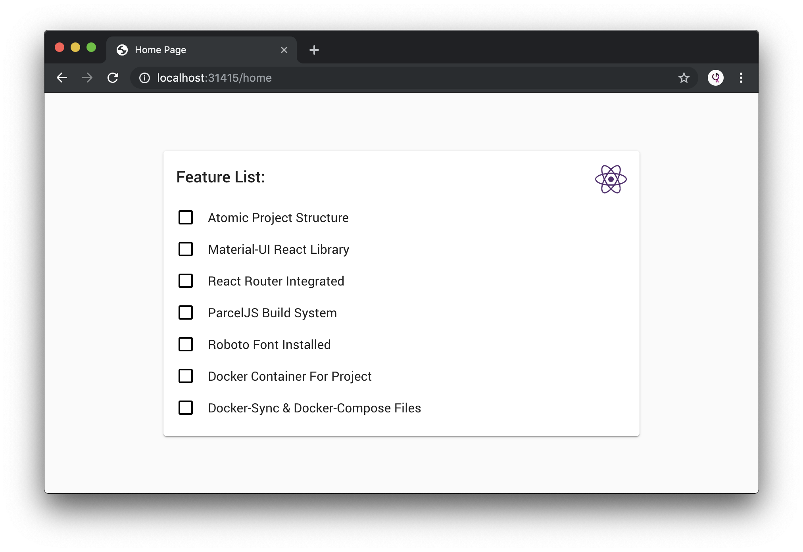

# React-Boilerplate
> Boilerplate for ReactJS using ParcelJS Build System




### About

This boilerplate is aimed to be super minimal. It is a collection of technologies that help simplify development within the ReactJS framework. This boilerplate comes with the following features:

- Atomic Project Structure
- Material-UI React Library
- React Router Integrated
- ParcelJS Build System
- Roboto Font Installed
- Docker Container For Project
- Docker-Sync & Docker-Compose Files

### Development Enviornment

A [Dockerfile](Dockerfile) exists in the root project directory and can be used on it's own or with technologies such as `docker-sync` and `docker-compose`. Below are some of the different ways you can start developing right away. Once executed, your site should be served on [http://localhost:31415](http://localhost:31415).

##### Local Machine

```shell
yarn install
yarn serve
```

##### Docker Sync & Docker Compose

```shell
# Spin-Up
$ docker-sync start
$ docker-compose up
# Spin-Down
$ docker-compose down
$ docker-sync stop
$ docker-sync clean
```

##### Docker Sync Stack

```shell
# Spin-Up
docker-sync-stack start
# Spin-Down
docker-sync-stack clean
```
